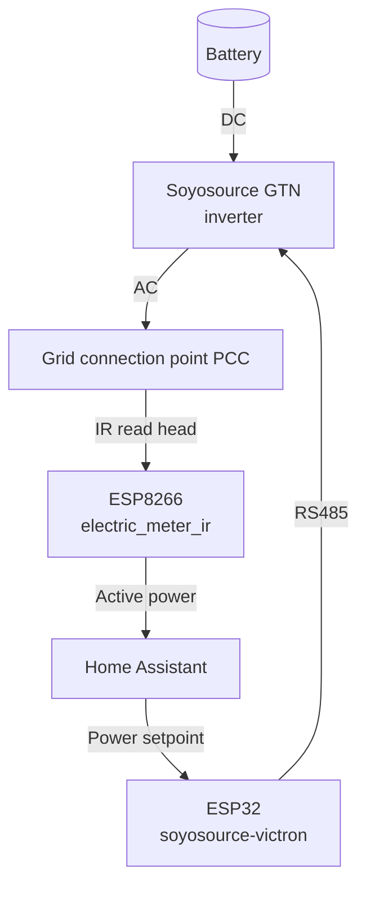
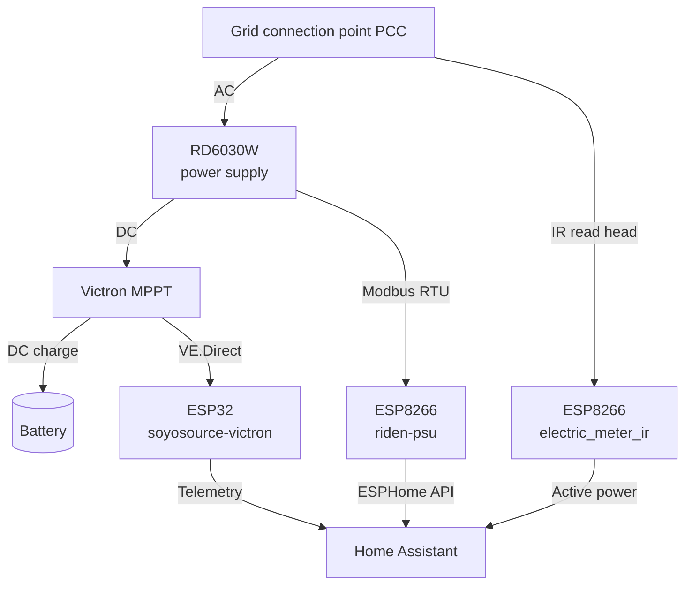

# Home Automation

Configurations for my smart home setup: power meter, balcony solar feed-in limiter,
solar charge controller and surplus-based charging with a lab power supply.

## Overview

The repository is split into three areas:

- [esphome/](esphome/) – ESPHome firmware YAMLs for the ESP devices
- [homeassistant/](homeassistant/) – Home Assistant configuration (packages, dashboard,
  and the mirrored top-level config files)
- [venus-os/](venus-os/) – Services for the Cerbo GX / Venus OS

### Feed-in control (Soyosource)



### Surplus charging (RD6030W)



The Soyosource GTN is connected directly to the battery (DC) and feeds into the house
grid via its AC output. The RD6030W draws AC from the grid connection point and outputs
DC to the PV input of the Victron MPPT — the power supply emulates a PV string, and the
MPPT charges the battery from it in a regulation-compliant way.

The two modes are mutually exclusive: when the balcony solar plant produces more than is
consumed (surplus at the meter), the RD6030W charges the battery — the Soyosource does
not feed in during that time. Only once the battery is full or there is no more surplus
can the Soyosource feed in from the battery again. Running both at the same time would
create a pointless cycle (grid → RD6030W → battery → Soyosource → grid).

The Victron is only read by the ESP32 via VE.Direct (telemetry), not actively controlled.
The IR meter additionally publishes its values via MQTT so that a Venus OS service on
the Cerbo GX can turn them into a Victron grid meter service on D-Bus. Venus OS cannot
read ESPHome devices directly; the MQTT-to-D-Bus service on the Cerbo remains necessary.
The service lives in [venus-os/mqtt-grid-meter/](venus-os/mqtt-grid-meter/) and uses the
Home Assistant MQTT broker; Node-RED is not needed.

OpenDTU/Hoymiles data is integrated on the Cerbo as a PV inverter, not as another grid
meter. For that, `henne49/dbus-opendtu` runs directly on Venus OS and queries OpenDTU
through the REST API. An installation note and example configuration are available under
[venus-os/](venus-os/).

## ESPHome

| File | Hardware | Purpose |
| --- | --- | --- |
| [esphome/electric_meter_ir.yaml](esphome/electric_meter_ir.yaml) | ESP8266 (D1 mini) + Hichi IR read head | Read the SML meter via UART, expose OBIS values as HA sensors |
| [esphome/riden-psu.yaml](esphome/riden-psu.yaml) | ESP8266 (Riden WiFi dongle / ESP-12F) + Modbus RTU | Read and control the RD60xx power supply via Modbus, expose entities to HA via the ESPHome API |
| [esphome/soyosource-victron-esp32.yaml](esphome/soyosource-victron-esp32.yaml) | ESP32 + MAX485 + VE.Direct | Soyosource GTN limiter (RS485) and Victron MPPT + SmartShunt (VE.Direct) on one device |

Shared blocks (WiFi, API, OTA, web server) live in
[esphome/common/base.yaml](esphome/common/base.yaml) and are pulled into each device
config via `packages: base: !include common/base.yaml`.

External components used:

- [syssi/esphome-soyosource-gtn-virtual-meter](https://github.com/syssi/esphome-soyosource-gtn-virtual-meter)
- [KinDR007/VictronMPPT-ESPHOME](https://github.com/KinDR007/VictronMPPT-ESPHOME)

### Secrets

Create `esphome/secrets.yaml` from
[esphome/secrets.yaml.example](esphome/secrets.yaml.example) and fill it in
(WiFi, OTA, API key, MQTT for the IR meter).

### Flashing

```sh
cd esphome
esphome run electric_meter_ir.yaml
esphome run riden-psu.yaml
esphome run soyosource-victron-esp32.yaml
```

## Home Assistant

| File | Purpose |
| --- | --- |
| [homeassistant/packages/energy_meter_common.yaml](homeassistant/packages/energy_meter_common.yaml) | Shared sensors derived from the grid meter (`sensor.grid_power_average`) used by the controllers |
| [homeassistant/packages/rd6030_battery_surplus_charge.yaml](homeassistant/packages/rd6030_battery_surplus_charge.yaml) | Surplus charging of the battery via the ESPHome-integrated RD6030W |
| [homeassistant/packages/soyosource_feed_in_control.yaml](homeassistant/packages/soyosource_feed_in_control.yaml) | Feed-in control for the Soyosource in manual mode |
| [homeassistant/packages/ir_heizung_kinderzimmer2_control.yaml](homeassistant/packages/ir_heizung_kinderzimmer2_control.yaml) | Enables an IR heater when surplus exceeds the battery charging ceiling |
| [homeassistant/packages/waste_collection.yaml](homeassistant/packages/waste_collection.yaml) | Waste collection schedule (HACS integration, ICS source) |

The [homeassistant/](homeassistant/) directory mirrors a complete Home Assistant config
directory; see [homeassistant/README.md](homeassistant/README.md) for installation, the
surplus-charging control flow and the YAML dashboard. Device credentials live in
`esphome/secrets.yaml`; one HA secret is still required (`waste_ics_url`) for
[homeassistant/packages/waste_collection.yaml](homeassistant/packages/waste_collection.yaml).

### Riden dongle / ESPHome

The RD6030W is no longer driven directly from Home Assistant via Modbus/TCP or HTTP.
Instead, an ESPHome firmware runs on its internal WiFi dongle, talks Modbus RTU to the
power supply and exposes the entities to Home Assistant through the ESPHome API.

The configuration in [esphome/riden-psu.yaml](esphome/riden-psu.yaml) is based on
**[morgendagen/riden-dongle](https://github.com/morgendagen/riden-dongle)**.

> **Hardware note:** Newer dongles use an ESP8684 chip with an encrypted bootloader
> (not flashable). These must first be converted to an ESP-12F before the firmware can
> be flashed. See the project's README for details.

## Safety notes

- 230 V wiring of the Soyosource and RD6030W belongs in qualified hands.
- RD6030W → MPPT PV input: keep the output voltage within the MPPT's allowed PV input
  window (mind Vmax) and limit the current to the model's rating. Real PV modules and
  the RD6030 must not run in parallel on the same MPPT input without decoupling
  (avoid back-feeding the power supply — e.g. blocking diode or changeover switching).
- The actual charge termination is handled by the Victron MPPT incl. BMS cut-off; this
  automation only controls the supplied power and does not replace hardware protection.
- Start with conservative setpoints (max. charge current, power demand) and observe live
  operation before raising limits.

## License

[MIT](LICENSE)
