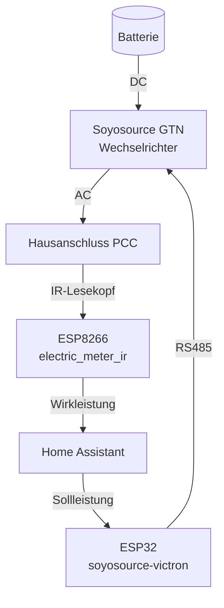
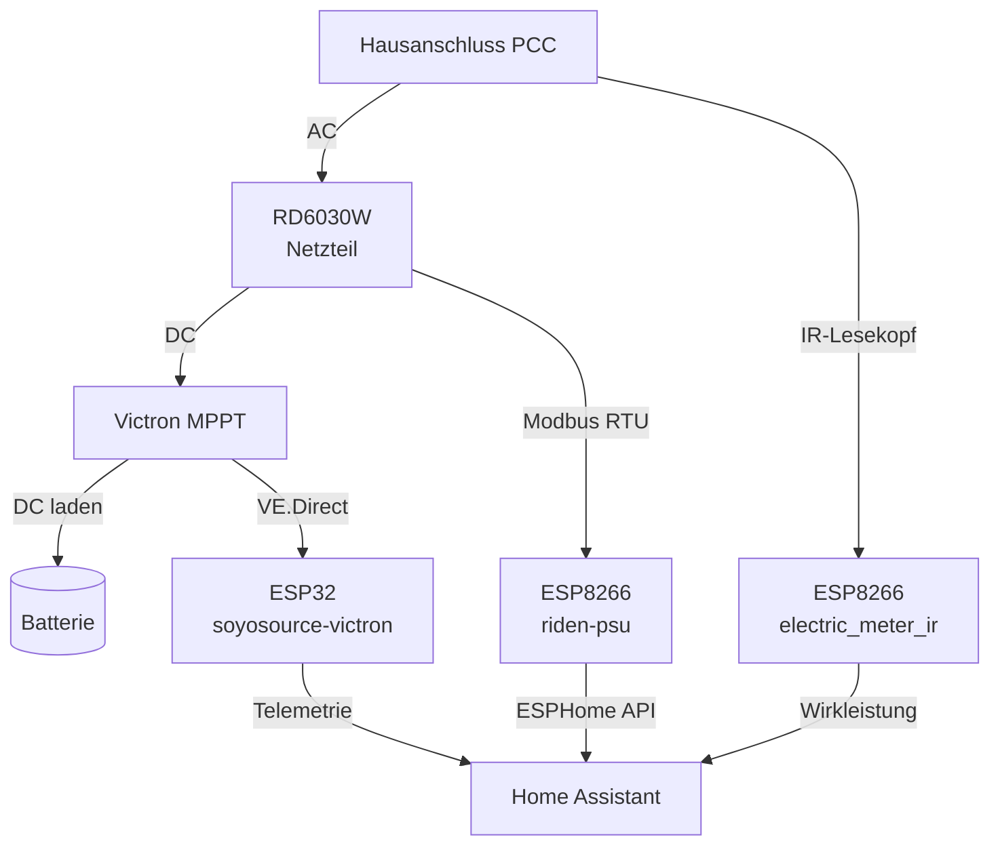

# Home Automation

Konfigurationen für mein Smart-Home-Setup rund um Stromzähler, Balkonkraftwerk-Limiter,
Solarladeregler und überschussbasiertes Laden eines Labornetzteils.

## Überblick

Das Repo ist in zwei Bereiche aufgeteilt:

- [esphome/](esphome/) – ESPHome-Firmware-YAMLs für die ESP-Geräte
- [homeassistant/](homeassistant/) – Home Assistant-Konfiguration (als Packages)

### Einspeiseregelung (Soyosource)



### Ueberschussladen (RD6030W)



Der Soyosource GTN ist direkt an der Batterie (DC) angeschlossen und speist über seinen
AC-Ausgang ins Hausnetz ein. Das RD6030W bezieht AC vom Hausanschluss und gibt DC an den
PV-Eingang des Victron-MPPT — das Netzteil emuliert einen PV-String, der MPPT lädt damit
die Batterie regelkonform.

Die beiden Modi schließen sich gegenseitig aus: Wenn das Balkonkraftwerk mehr erzeugt als
verbraucht wird (Überschuss am Zähler), lädt der RD6030W die Batterie — der Soyosource
speist in diesem Fall nicht ein. Erst wenn die Batterie geladen ist oder kein Überschuss
mehr vorhanden ist, kann der Soyosource wieder aus der Batterie ins Netz einspeisen.
Beide gleichzeitig aktiv würden einen sinnlosen Kreislauf erzeugen (Netz → RD6030W →
Batterie → Soyosource → Netz).

Der Victron wird vom ESP32 nur per VE.Direct mitgelesen (Telemetrie), nicht aktiv gesteuert.

## ESPHome

| Datei | Hardware | Zweck |
| --- | --- | --- |
| [esphome/electric_meter_ir.yaml](esphome/electric_meter_ir.yaml) | ESP8266 (D1 mini) + Hichi IR-Lesekopf | SML-Zähler über UART auslesen, OBIS-Werte als HA-Sensoren |
| [esphome/riden-psu.yaml](esphome/riden-psu.yaml) | ESP8266 (Riden WiFi-Dongle / ESP-12F) + Modbus RTU | RD60xx-Netzteil per Modbus auslesen und steuern, Entitäten per ESPHome API nach HA bringen |
| [esphome/soyosource-victron-esp32.yaml](esphome/soyosource-victron-esp32.yaml) | ESP32 + MAX485 + VE.Direct | Soyosource GTN Limiter (RS485) und Victron MPPT (VE.Direct) auf einem Gerät |

Genutzte externe Komponenten:

- [syssi/esphome-soyosource-gtn-virtual-meter](https://github.com/syssi/esphome-soyosource-gtn-virtual-meter)
- [KinDR007/VictronMPPT-ESPHOME](https://github.com/KinDR007/VictronMPPT-ESPHOME)

### Secrets

`esphome/secrets.yaml` aus [esphome/secrets.yaml.example](esphome/secrets.yaml.example) erzeugen
und ausfüllen (WLAN, OTA, API-Key).

### Flashen

```sh
cd esphome
esphome run electric_meter_ir.yaml
esphome run riden-psu.yaml
esphome run soyosource-victron-esp32.yaml
```

## Home Assistant

| Datei | Zweck |
| --- | --- |
| [homeassistant/packages/rd6030_battery_surplus_charge.yaml](homeassistant/packages/rd6030_battery_surplus_charge.yaml) | Überschussladung der Batterie über den per ESPHome eingebundenen RD6030W |
| [homeassistant/packages/soyosource_feed_in_control.yaml](homeassistant/packages/soyosource_feed_in_control.yaml) | Einspeiseregelung für den Soyosource im Handbetrieb |

### Riden-Dongle / ESPHome

Der RD6030W wird hier nicht mehr direkt aus Home Assistant per Modbus/TCP oder HTTP
angesprochen. Stattdessen läuft auf dem internen WLAN-Dongle eine ESPHome-Firmware,
die per Modbus RTU mit dem Netzteil spricht und die Entitäten über die ESPHome-API
in Home Assistant bereitstellt.

Die Konfiguration in [esphome/riden-psu.yaml](esphome/riden-psu.yaml) basiert auf
**[morgendagen/riden-dongle](https://github.com/morgendagen/riden-dongle)**.

Empfohlen: **[morgendagen/riden-dongle](https://github.com/morgendagen/riden-dongle)** –
PlatformIO-Firmware (ESP8266/ESP-12F), die Modbus TCP, SCPI und ein Web-Interface bereitstellt.

> **Hinweis Hardware:** Neuere Dongles verwenden einen ESP8684-Chip mit verschlüsseltem
> Bootloader (nicht flashbar). Diese müssen erst auf einen ESP-12F umgerüstet werden, bevor
> riden-dongle aufgespielt werden kann. Details siehe README des Projekts.

### Einbinden

In `configuration.yaml`:

```yaml
homeassistant:
  packages: !include_dir_named packages/
```

Dann den Package-Ordner mit dem Inhalt aus [homeassistant/packages/](homeassistant/packages/)
befüllen. Für die aktuell versionierten Packages ist kein eigenes
`homeassistant/secrets.yaml` mehr erforderlich; die Zugangsdaten liegen in
`esphome/secrets.yaml` für die jeweiligen ESPHome-Geräte.

## Sicherheitshinweise

- 230 V-Verkabelung von Soyosource und RD6030W gehört in qualifizierte Hände.
- RD6030W → MPPT-PV-Eingang: Ausgangsspannung innerhalb des erlaubten PV-Eingangsfensters
  des MPPT halten (Vmax beachten) und Strom auf das Modell-Limit begrenzen. Echte PV-Module
  und der RD6030 dürfen am selben MPPT-Eingang nicht ohne Entkopplung parallel betrieben
  werden (Rückspeisung in das Netzteil vermeiden — z. B. Sperrdiode oder Umschaltung).
- Die eigentliche Ladeschluss-Regelung übernimmt der Victron-MPPT inkl. BMS-Abschaltung;
  diese Automatisierung steuert nur die zugeführte Leistung und ersetzt keine
  Hardware-Schutzmaßnahmen.
- Steuerwerte (max. Ladestrom, Sollleistung) konservativ einstellen und im Live-Betrieb
  beobachten, bevor Limits hochgezogen werden.

## Lizenz

[MIT](LICENSE)
