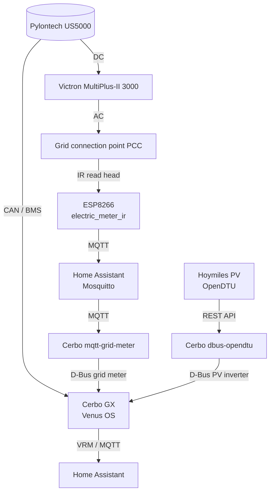

# Home Automation

Configurations for my smart home setup: grid meter, balcony PV (OpenDTU/Hoymiles),
and a Victron ESS (MultiPlus-II + Pylontech) on Cerbo GX / Venus OS.

## Overview

The repository is split into three areas:

- [esphome/](esphome/) – ESPHome firmware YAMLs for the ESP devices
- [homeassistant/](homeassistant/) – Home Assistant configuration (packages, dashboard,
  and the mirrored top-level config files)
- [venus-os/](venus-os/) – Services for the Cerbo GX / Venus OS

### Current power system



Charge/discharge and ESS behaviour are handled by the MultiPlus-II under Venus OS
(with the Pylontech BMS). Home Assistant no longer drives a lab PSU or a Soyosource
limiter for battery control.

The IR meter publishes its values via MQTT so that a Venus OS service on the Cerbo GX
can turn them into a Victron grid meter on D-Bus. Venus OS cannot read ESPHome devices
directly; the MQTT-to-D-Bus service on the Cerbo remains necessary. The service lives in
[venus-os/mqtt-grid-meter/](venus-os/mqtt-grid-meter/) and uses the Home Assistant MQTT
broker; Node-RED is not needed.

OpenDTU/Hoymiles data is integrated on the Cerbo as a PV inverter, not as another grid
meter. For that, `henne49/dbus-opendtu` runs directly on Venus OS and queries OpenDTU
through the REST API. An installation note and example configuration are available under
[venus-os/](venus-os/).

### Retired hardware (kept for reference)

The following paths remain in the repo but are **not in use** anymore (replaced by the
MultiPlus-II + Pylontech ESS):

| Path | Former role |
| --- | --- |
| [esphome/riden-psu.yaml](esphome/riden-psu.yaml) | RD6030W via Modbus on the Riden WiFi dongle |
| [esphome/soyosource-victron-esp32.yaml](esphome/soyosource-victron-esp32.yaml) | Soyosource GTN limiter + Victron MPPT/SmartShunt telemetry |
| [homeassistant/packages/rd6030_battery_surplus_charge.yaml](homeassistant/packages/rd6030_battery_surplus_charge.yaml) | HA surplus charging via RD6030W |
| [homeassistant/packages/soyosource_feed_in_control.yaml](homeassistant/packages/soyosource_feed_in_control.yaml) | HA feed-in control for the Soyosource |

## ESPHome

| File | Hardware | Purpose | Status |
| --- | --- | --- | --- |
| [esphome/electric_meter_ir.yaml](esphome/electric_meter_ir.yaml) | ESP8266 (D1 mini) + Hichi IR read head | Read the SML meter via UART, expose OBIS values as HA sensors / MQTT | Active |
| [esphome/riden-psu.yaml](esphome/riden-psu.yaml) | ESP8266 (Riden WiFi dongle / ESP-12F) + Modbus RTU | RD60xx power supply control | Retired |
| [esphome/soyosource-victron-esp32.yaml](esphome/soyosource-victron-esp32.yaml) | ESP32 + MAX485 + VE.Direct | Soyosource limiter + MPPT/Shunt telemetry | Retired (needs the vendored external components above) |

Shared blocks (WiFi, API, OTA, web server) live in
[esphome/common/base.yaml](esphome/common/base.yaml) and are pulled into each device
config via `packages: base: !include common/base.yaml`.

External components used by active configs: none beyond stock ESPHome (SML meter).
Retired configs additionally referenced (and vendored under `esphome/.esphome/external_components/`,
pulled in by `soyosource-victron-esp32.yaml` with `refresh: 0s`, so they are not fetched live):

- [syssi/esphome-soyosource-gtn-virtual-meter](https://github.com/syssi/esphome-soyosource-gtn-virtual-meter)
- [KinDR007/VictronMPPT-ESPHOME](https://github.com/KinDR007/VictronMPPT-ESPHOME)

`riden-psu.yaml` was *inspired by* [morgendagen/riden-dongle](https://github.com/morgendagen/riden-dongle)
but uses only stock ESPHome `modbus_controller` and does not depend on that external component.

### Secrets

Create `esphome/secrets.yaml` from
[esphome/secrets.yaml.example](esphome/secrets.yaml.example) and fill it in
(WiFi, OTA, API key, MQTT for the IR meter).

### Flashing

```sh
cd esphome
esphome run electric_meter_ir.yaml
```

## Home Assistant

| File | Purpose | Status |
| --- | --- | --- |
| [homeassistant/packages/energy_meter_common.yaml](homeassistant/packages/energy_meter_common.yaml) | Shared sensors derived from the grid meter (`sensor.grid_power_average`) | Active |
| [homeassistant/packages/ir_heizung_kinderzimmer2_control.yaml](homeassistant/packages/ir_heizung_kinderzimmer2_control.yaml) | Enables an IR heater on sustained grid export when battery SOC ≥ 98.9 % and not discharging (turns off below SOC 97 % / on discharge, with hysteresis) | Active |
| [homeassistant/packages/waste_collection.yaml](homeassistant/packages/waste_collection.yaml) | Waste collection schedule (HACS integration, ICS source) | Active |
| [homeassistant/packages/rd6030_battery_surplus_charge.yaml](homeassistant/packages/rd6030_battery_surplus_charge.yaml) | Surplus charging via RD6030W | Retired |
| [homeassistant/packages/soyosource_feed_in_control.yaml](homeassistant/packages/soyosource_feed_in_control.yaml) | Soyosource feed-in control | Retired |

The [homeassistant/](homeassistant/) directory mirrors a complete Home Assistant config
directory; see [homeassistant/README.md](homeassistant/README.md) for installation and
the YAML dashboard. Device credentials live in `esphome/secrets.yaml`; one HA secret is
still required (`waste_ics_url`) for
[homeassistant/packages/waste_collection.yaml](homeassistant/packages/waste_collection.yaml).

Battery SOC/power and MultiPlus metrics come from the Cerbo GX / VRM integration (e.g.
`sensor.gx_device_dc_batterieladung`, `sensor.gx_device_dc_batterieleistung`), not from
the retired ESP32 VE.Direct bridge.

## Safety notes

- MultiPlus-II AC wiring, battery cabling, and Pylontech CAN/BMS setup belong in
  qualified hands and must follow Victron/Pylontech installation manuals.
- ESS charge limits and battery protection are handled by Venus OS + the Pylontech BMS;
  Home Assistant automations must not bypass those limits.
- Start with conservative ESS setpoints and observe live operation before raising limits.

## License

[MIT](LICENSE)
