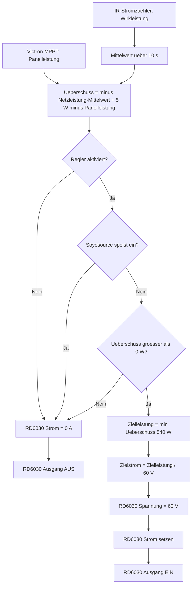

# Home Assistant

Die Packages aus diesem Repository liegen in [packages/](packages/).

Damit Home Assistant sie lädt, muss in der aktiven `configuration.yaml` stehen:

```yaml
homeassistant:
  packages: !include_dir_named packages/
```

Danach die gewünschte Datei nach `packages/` legen und Home Assistant neu laden oder neu starten.

## Ablauf Ueberschussladen

Das folgende Diagramm beschreibt die Funktion von
[packages/rd6030_battery_surplus_charge.yaml](packages/rd6030_battery_surplus_charge.yaml).



Kurz gesagt:

- negativer Netzleistungswert bedeutet Einspeisung und damit verfuegbaren Ueberschuss
- der Mittelwert glaettet Schwankungen des Stromzaehlers
- ein Offset von 5 W sorgt dafuer, dass erst bei mindestens 5 W Einspeisung geladen wird
- die Panelleistung des Victron MPPT wird vom Netzwert abgezogen, da sie bereits als Ueberschuss gilt
- die Zielleistung ist auf 540 W (9 A bei 60 V) begrenzt
- die Ladespannung ist fest auf 60 V eingestellt
- solange der Soyosource-Wechselrichter einspeist, wird das Laden pausiert

Voraussetzungen:

- die ESPHome-Integration fuer [../esphome/riden-psu.yaml](../esphome/riden-psu.yaml) ist in Home Assistant eingebunden
- die Entitaeten `number.riden_psu_voltage_set`, `number.riden_psu_current_set` und `switch.riden_psu_output` sind verfuegbar
- die ESPHome-Integration fuer [../esphome/soyosource-victron-esp32.yaml](../esphome/soyosource-victron-esp32.yaml) ist eingebunden (liefert `sensor.soyosource_aktive_sollleistung` und `sensor.soyosource_victron_esp32_mppt_panel_power`)

## Dashboard als YAML

Die Dashboards liegen in [dashboards/](dashboards/). Das Beispiel-Dashboard liegt in
[dashboards/dashboard_energy_control.yaml](dashboards/dashboard_energy_control.yaml).

Damit Home Assistant es als config-as-code laedt, muss in der aktiven
`configuration.yaml` ein YAML-Dashboard eingetragen sein:

```yaml
lovelace:
  dashboards:
    energie-steuerung:
      mode: yaml
      title: Energie Steuerung
      icon: mdi:transmission-tower
      show_in_sidebar: true
      filename: dashboards/dashboard_energy_control.yaml
```

Danach den Ordner `dashboards/` in das aktive Home-Assistant-
Konfigurationsverzeichnis legen und Home Assistant neu laden oder neu starten.

Das Dashboard zeigt insbesondere:

- aktuelle Netzleistung ueber `sensor.electric_meter_ir_active_power`
- aktuelle PV-Leistung ueber `sensor.opendtu_91fd98_ac_power`
- Handbetrieb und Sollleistung des Soyosource-Wechselrichters
- Status, Parameter und Diagnose der HA-Feed-in-Control
- den Bezug zum RD6030-Ueberschussladen