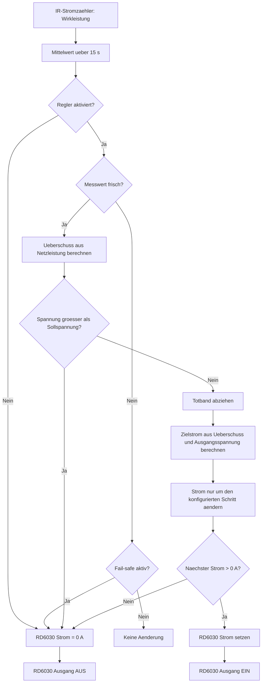

# Home Assistant

Die Packages aus diesem Repository liegen in [packages/](packages/).

Damit Home Assistant sie lädt, muss in der aktiven `configuration.yaml` stehen:

```yaml
homeassistant:
  packages: !include_dir_named packages/
```

Danach die gewünschte Datei nach `packages/` legen und Home Assistant neu laden oder neu starten.

## Ablauf Ueberschussladen

Das folgende Diagramm beschreibt die Funktion von
[packages/rd6030_battery_surplus_charge.yaml](packages/rd6030_battery_surplus_charge.yaml).



Kurz gesagt:

- negativer Netzleistungswert bedeutet Einspeisung und damit verfuegbaren Ueberschuss
- der Mittelwert glättet Schwankungen des Stromzaehlers
- das Totband verhindert staendiges Nachregeln bei kleinen Abweichungen
- aus verfuegbarer Leistung und Ausgangsspannung wird ein Zielstrom berechnet
- der RD6030 aendert seinen Strom nur schrittweise, um ruhiger zu regeln
- bei veralteten Messwerten oder zu hoher Spannung wird sicher abgeschaltet

Beispiel:

- [packages/soyosource_feed_in_control.yaml](packages/soyosource_feed_in_control.yaml)

## Dashboard als YAML

Die Dashboards liegen in [dashboards/](dashboards/). Das Beispiel-Dashboard liegt in
[dashboards/dashboard_energy_control.yaml](dashboards/dashboard_energy_control.yaml).

Damit Home Assistant es als config-as-code laedt, muss in der aktiven
`configuration.yaml` ein YAML-Dashboard eingetragen sein:

```yaml
lovelace:
  dashboards:
    energie-steuerung:
      mode: yaml
      title: Energie Steuerung
      icon: mdi:transmission-tower
      show_in_sidebar: true
      filename: dashboards/dashboard_energy_control.yaml
```

Danach den Ordner `dashboards/` in das aktive Home-Assistant-
Konfigurationsverzeichnis legen und Home Assistant neu laden oder neu starten.

Das Dashboard zeigt insbesondere:

- aktuelle Netzleistung ueber `sensor.electric_meter_ir_active_power`
- aktuelle PV-Leistung ueber `sensor.opendtu_91fd98_ac_power`
- Handbetrieb und Sollleistung des Soyosource-Wechselrichters
- Status, Parameter und Diagnose der HA-Feed-in-Control
- den Bezug zum RD6030-Ueberschussladen