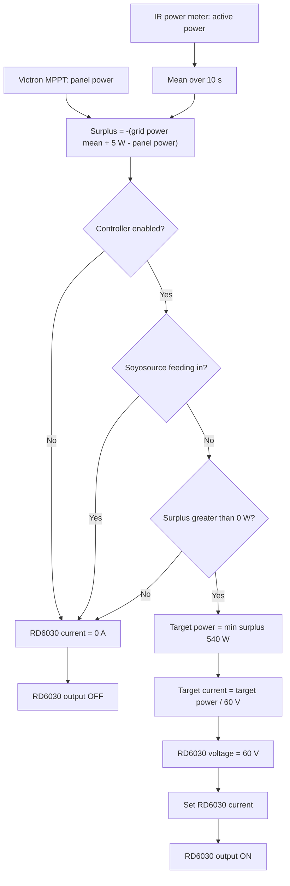

# Home Assistant

This directory mirrors a complete Home Assistant config directory: the versioned
`configuration.yaml` together with `automations.yaml`, `scripts.yaml`, `scenes.yaml`,
`climate.yaml` and `influxdb.yaml` can be used as-is. The packages live in
[packages/](packages/), the YAML dashboard in [dashboards/](dashboards/).

## Setup

Packages are loaded via `configuration.yaml`:

```yaml
homeassistant:
  packages: !include_dir_named packages
```

Copy the desired files from [packages/](packages/) into the `packages/` folder of the
active config directory, then reload or restart Home Assistant.

One secret is required in the active `secrets.yaml`: `waste_ics_url` (ICS calendar URL)
for [packages/waste_collection.yaml](packages/waste_collection.yaml).

## Surplus charging control flow

The following diagram describes the function of
[packages/rd6030_battery_surplus_charge.yaml](packages/rd6030_battery_surplus_charge.yaml).



In short:

- a negative grid power value means feed-in and therefore available surplus
- the mean smooths out fluctuations of the power meter
- a 5 W offset ensures charging only starts at at least 5 W of feed-in
- the panel power of the Victron MPPT is subtracted from the grid value since it
  already counts as surplus
- the target power is limited to 540 W (9 A at 60 V)
- the charge voltage is fixed at 60 V
- charging is paused while the Soyosource inverter is feeding in

Prerequisites:

- the ESPHome integration for [../esphome/riden-psu.yaml](../esphome/riden-psu.yaml) is
  set up in Home Assistant, providing `number.riden_psu_voltage_set`,
  `number.riden_psu_current_set` and `switch.riden_psu_output`
- the ESPHome integration for
  [../esphome/soyosource-victron-esp32.yaml](../esphome/soyosource-victron-esp32.yaml)
  is set up, providing `sensor.soyosource_victron_esp32_mppt_panel_power`
- [packages/energy_meter_common.yaml](packages/energy_meter_common.yaml) is installed,
  providing `sensor.grid_power_average`
- [packages/soyosource_feed_in_control.yaml](packages/soyosource_feed_in_control.yaml)
  is installed, providing `sensor.soyosource_aktive_sollleistung`

## Dashboard as YAML

The example dashboard lives in
[dashboards/dashboard_energy_control.yaml](dashboards/dashboard_energy_control.yaml).

For Home Assistant to load it as config-as-code, a YAML dashboard must be registered in
the active `configuration.yaml`:

```yaml
lovelace:
  dashboards:
    energie-steuerung:
      mode: yaml
      title: Energie Steuerung
      icon: mdi:transmission-tower
      show_in_sidebar: true
      filename: dashboards/dashboard_energy_control.yaml
```

Then copy the `dashboards/` folder into the active Home Assistant config directory and
reload or restart Home Assistant.

The dashboard shows in particular:

- current grid power via `sensor.electric_meter_ir_active_power`
- current PV power via `sensor.opendtu_91fd98_ac_power`
- manual mode and power setpoint of the Soyosource inverter
- status, parameters and diagnostics of the HA feed-in control
- the relation to RD6030 surplus charging
